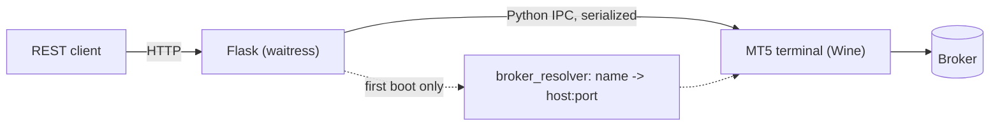

# Architecture

- **`app/`** — Flask routes (`app/routes/`), safety controls
  (`pretrade.py`, `kill_switch.py`, `idempotency.py`), the MT5 connection
  singleton (`mt5_connection.py`), and the broker resolver
  (`broker_resolver.py`).
- **`scripts/`** — boot sequence (`01-start.sh` … `06-install-libraries.sh`),
  Wine/MT5 install, resolver cascade, and headless login
  (`04-install-mt5.sh`).
- MT5 state persists in the `/config` Docker volume — `servers.dat`, Wine
  prefix state, and account session all survive a container restart.

Every call into the MT5 terminal goes through a single process-global,
serialized IPC client (`SerializedMT5` in `mt5_connection.py`) — MetaTrader5's
Python API is not safe for concurrent access, so one Flask process per
account/container is a hard requirement, not a scaling choice.
