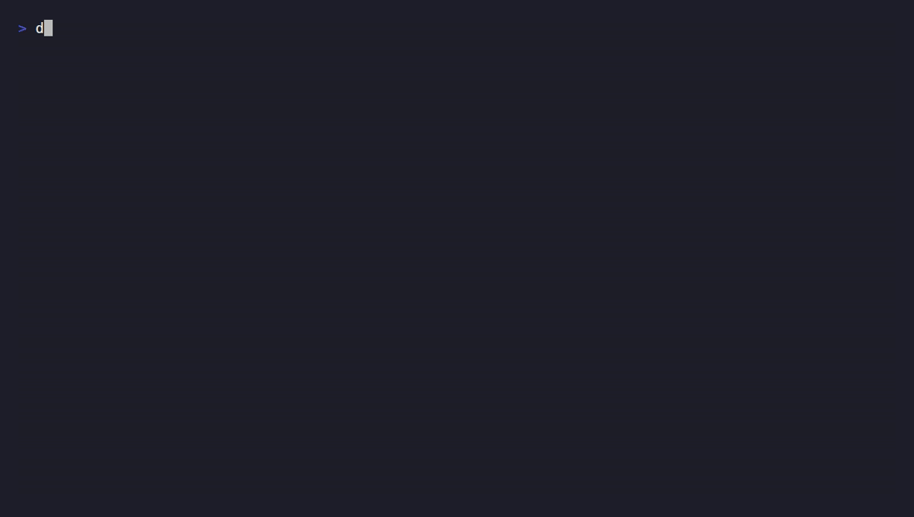

<section class="mtg-hero" markdown="1">

  MIT licensed
  Docker Hub
  any MetaQuotes broker

# Trade MetaTrader 5 over plain HTTP — <em>headless, any broker.</em> { .mtg-hero__lede }

mt5-gateway runs the real MT5 terminal under Wine in Docker and exposes it as a
REST API. Point it at any MetaQuotes broker with three env vars and it logs
itself in on boot — no Windows, no VNC, no manual clicking.

  <a class="mtg-btn mtg-btn--primary" href="get-started/quickstart/">
    Run it in 5 minutes&rarr;
  </a>
  <a class="mtg-btn" href="#see-it-boot">Watch the terminal demo</a>
  <a class="mtg-btn" href="reference/configuration/">Every config var</a>

  EURUSD 1.08501 &#9650;&middot;
  XAUUSD 2412.30 &#9660;&middot;
  GBPUSD 1.27180 &#9650;&middot;
  USDJPY 148.220 &#9660;&middot;
  XAUUSD 2412.30 &#9660;&middot;
  EURUSD 1.08501 &#9650;&middot;
  GBPUSD 1.27180 &#9650;

</section>

  
  

    Pull the image, run it headless, confirm it's alive and trading-ready — the
    exact commands from <a href="get-started/quickstart/">Quickstart</a>.
    Recorded with <a href="https://github.com/charmbracelet/vhs">VHS</a>; the
    tape is <a href="https://github.com/elitekaycy/mt5-gateway/blob/main/docs/assets/mt5-gateway-demo.tape">committed and regenerable</a>.
  

<section class="mtg-section" markdown="1">

  &sect; 01
  <h2>How it works, in three steps</h2>

1

<h3>Give it a server name</h3>

Not an IP, not a broker directory file — just the broker's server name
(e.g. <code>Exness-MT5Trial9</code>), your login, and your password.

2

<h3>It resolves and logs in</h3>

The gateway turns that name into a connectable address, launches the
real MT5 terminal under Wine, and authorizes — headless, no VNC.

3

<h3>Trade over REST</h3>

Orders, positions, ticks, and history — all plain HTTP, with
idempotency keys, a kill switch, and broker-truth reconciliation.

</section>

<section class="mtg-section" markdown="1">

  &sect; 02
  <h2>What you get</h2>

- **Headless login, any broker**

    ---

    No `servers.dat`, no manual click-through. Give it a server name and it
    resolves and connects on its own. See
    [why this exists](concepts/why-headless-login.md).

- **REST API + Swagger**

    ---

    Every endpoint documented and callable from `/apidocs` the moment the
    container is up. See the [API reference](reference/api.md).

- **Idempotent orders**

    ---

    A stable `Idempotency-Key` makes retries safe — replay the same response
    instead of a duplicate order. Full detail in the
    [API reference](reference/api.md).

- **Kill switch + audit log**

    ---

    `POST /kill` halts trading instantly; every order is append-only logged.
    See [health, kill switch, and metrics](operations/health-and-safety.md).

- **Broker-truth reconciliation**

    ---

    `GET /reconcile` returns real positions, orders, and deals — recover
    strategy state after a restart or an ambiguous response.

- **Drop-in broker for qkt**

    ---

    [qkt](https://github.com/elitekaycy/qkt) — an event-driven trading
    engine — talks to this gateway out of the box. See
    [Using with qkt](connect/qkt.md).

</section>

<section class="mtg-section" markdown="1">

  &sect; 03
  <h2>Get started</h2>

- [Quickstart](get-started/quickstart.md) — pull the image, run it, confirm it's alive.
- [Install MT5 + mt5-gateway on a terminal](get-started/install-mt5-terminal.md) — the boot sequence, step by step.
- [Production deploy](get-started/production-deploy.md) — a hardened Compose example.
- [Configuration](reference/configuration.md) — every env var, core vs optional.

</section>

Built on the foundation laid by
<a href="https://github.com/slowfound">slowfound</a> in
<a href="https://github.com/slowfound/metatrader5-quant-server-python">metatrader5-quant-server-python</a>.

