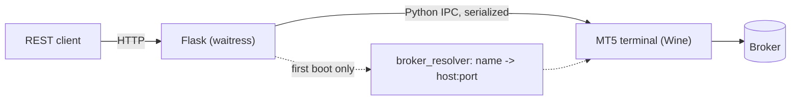

# mkdocs Documentation Site Implementation Plan

> **For agentic workers:** REQUIRED SUB-SKILL: Use superpowers:subagent-driven-development (recommended) or superpowers:executing-plans to implement this plan task-by-task. Steps use checkbox (`- [ ]`) syntax for tracking.

**Goal:** Stand up an mkdocs-material documentation site for mt5-gateway, deployed to GitHub Pages on push to `main`, mirroring qkt's pipeline and scaled down to a single-service project's nav.

**Architecture:** Static site built from `docs/**` by `mkdocs build --strict`, themed with mkdocs-material (dark/light toggle, trading-floor-leaning palette via `extra.css`), deployed by a GitHub Actions workflow using `actions/upload-pages-artifact` + `actions/deploy-pages`. No API-doc generator step — the API reference page links to the live `/apidocs` Swagger UI instead of a static build.

**Tech Stack:** mkdocs 1.6.1, mkdocs-material 9.5.49, mkdocs-mermaid2-plugin 1.2.1, pymdown-extensions 10.21.2, pygments 2.20.0, Python 3.12, GitHub Actions.

## Global Constraints

- Deploy branch: `main`, this repo. Site URL: `https://elitekaycy.github.io/mt5-gateway/`.
- Nav stays small/focused — no tutorials/examples sections invented without real content.
- Configuration reference documents every env var found in `app/config.py`, `app/mt5_connection.py`, `app/pretrade.py`, `app/audit.py`, `app/kill_switch.py`, `app/request_limits.py`, `app/swagger.py`, split into **core** (required for headless login) vs **optional**.
- API reference is a pointer to the live `/apidocs` Swagger UI — no static OpenAPI export.
- No custom logo/brand SVGs yet — use a Material stock icon as logo+favicon.
- `docs/specs/` and `docs/plans/` are excluded from the built site nav (working documents, not public docs).
- Every task ends with `mkdocs build --strict` passing with zero warnings.
- Spec: `docs/specs/2026-08-18-mkdocs-site.md`.

---

## Task 1: Scaffold — mkdocs.yml, requirements-docs.txt, Home page, stylesheet

**Files:**
- Create: `requirements-docs.txt`
- Create: `mkdocs.yml`
- Create: `docs/index.md`
- Create: `docs/assets/extra.css`

**Interfaces:**
- Produces: `mkdocs.yml`'s `nav` list — every later task appends its own section to this list at the point marked `# TASK N` in this file's steps.

- [ ] **Step 1: Create `requirements-docs.txt`**

```text
mkdocs==1.6.1
mkdocs-material==9.5.49
mkdocs-mermaid2-plugin==1.2.1
pymdown-extensions==10.21.2
pygments==2.20.0
```

- [ ] **Step 2: Create `mkdocs.yml`**

```yaml
site_name: mt5-gateway
site_description: A headless REST API for MetaTrader 5, running under Wine on Linux in Docker.
site_url: https://elitekaycy.github.io/mt5-gateway/
repo_url: https://github.com/elitekaycy/mt5-gateway
repo_name: elitekaycy/mt5-gateway
edit_uri: edit/main/docs/
copyright: Copyright &copy; 2026 elitekaycy

docs_dir: docs
site_dir: site

exclude_docs: |
  specs/
  plans/

theme:
  name: material
  icon:
    logo: material/finance
    repo: fontawesome/brands/github
    edit: material/pencil
  favicon: assets/favicon-placeholder.svg
  palette:
    - media: "(prefers-color-scheme: dark)"
      scheme: slate
      toggle:
        icon: material/weather-sunny
        name: Switch to light mode
    - media: "(prefers-color-scheme: light)"
      scheme: default
      toggle:
        icon: material/weather-night
        name: Switch to dark mode
  features:
    - navigation.tabs
    - navigation.sections
    - navigation.indexes
    - navigation.top
    - navigation.tracking
    - toc.follow
    - search.highlight
    - search.share
    - search.suggest
    - content.code.copy
    - content.action.edit

extra_css:
  - assets/extra.css

plugins:
  - search
  - mermaid2:
      version: 10.9.0
      arguments:
        theme: 'dark'

markdown_extensions:
  - admonition
  - attr_list
  - md_in_html
  - footnotes
  - tables
  - toc:
      permalink: true
  - pymdownx.highlight:
      anchor_linenums: true
      line_spans: __span
      pygments_lang_class: true
  - pymdownx.inlinehilite
  - pymdownx.snippets
  - pymdownx.superfences:
      custom_fences:
        - name: mermaid
          class: mermaid
          format: !!python/name:mermaid2.fence_mermaid_custom
  - pymdownx.tabbed:
      alternate_style: true
  - pymdownx.tasklist:
      custom_checkbox: true
  - pymdownx.details

nav:
  - Home: index.md

extra:
  social:
    - icon: fontawesome/brands/github
      link: https://github.com/elitekaycy/mt5-gateway
  generator: false
```

Note: `theme.favicon` points at `assets/favicon-placeholder.svg`, created in Step 4 below — mkdocs-material requires a favicon file to exist even as a placeholder; a real brand favicon is a separate follow-up per the spec's non-goals.

- [ ] **Step 3: Create `docs/index.md`**

```markdown
# mt5-gateway

A REST API for **MetaTrader 5**, running headless under Wine on Linux in Docker.

Trade, stream prices, and read account state over plain HTTP — no Windows, no
desktop, no manual login. Point it at any MetaQuotes broker with three env
vars and it logs itself in on boot.

!!! warning
    This software can place real trades against real broker accounts. Test
    with a demo account first. It is provided without warranty; see the
    [LICENSE](https://github.com/elitekaycy/mt5-gateway/blob/main/LICENSE).

```bash
curl -H "Authorization: Bearer $API_KEY" http://localhost:5001/account
# {"ok": true, "login": 12345678, "server": "Exness-MT5Trial9",
#  "balance": 10000.0, "trade_allowed": true, "trade_expert": true, ...}
```

## Where to start

- New to the gateway? Start with [Quickstart](get-started/quickstart.md).
- Setting it up on a fresh terminal for the first time? See
  [Install MT5 + mt5-gateway on a terminal](get-started/install-mt5-terminal.md).
- Wiring it up as a broker for [qkt](https://github.com/elitekaycy/qkt)? See
  [Using with qkt](connect/qkt.md).
- Looking for a specific environment variable? See
  [Configuration](reference/configuration.md).

Built on the foundation laid by [slowfound](https://github.com/slowfound) in
[metatrader5-quant-server-python](https://github.com/slowfound/metatrader5-quant-server-python)
and his [tutorial series](https://youtube.com/playlist?list=PLotEOI0Sz3OzdSp7qR6vHs8EYnmQwqWAF).
```

- [ ] **Step 4: Create `docs/assets/extra.css` and a placeholder favicon**

```css
:root {
  --md-primary-fg-color: #0b3d2e;
  --md-primary-fg-color--dark: #082e22;
  --md-accent-fg-color: #2f9e6e;
}

[data-md-color-scheme="slate"] {
  --md-default-bg-color: #0a0e0c;
  --md-code-bg-color: #101512;
}

.md-typeset code {
  font-family: "JetBrains Mono", "SFMono-Regular", Consolas, monospace;
}
```

Create `docs/assets/favicon-placeholder.svg`:

```svg
<svg xmlns="http://www.w3.org/2000/svg" viewBox="0 0 32 32">
  <rect width="32" height="32" fill="#0b3d2e"/>
  <path d="M8 22 L8 14 L13 14 L13 8 L19 8 L19 18 L24 18 L24 22 Z" fill="#2f9e6e"/>
</svg>
```

- [ ] **Step 5: Verify the build**

Run: `pip install -r requirements-docs.txt && mkdocs build --strict`
Expected: `INFO - Documentation built in X.XX seconds` with no warnings, and a
`site/index.html` produced.

- [ ] **Step 6: Commit**

```bash
git add requirements-docs.txt mkdocs.yml docs/index.md docs/assets/extra.css docs/assets/favicon-placeholder.svg
git commit -m "docs(site): scaffold mkdocs site"
```

---

## Task 2: Get started section

**Files:**
- Create: `docs/get-started/index.md`
- Create: `docs/get-started/quickstart.md`
- Create: `docs/get-started/install-mt5-terminal.md`
- Create: `docs/get-started/production-deploy.md`
- Modify: `mkdocs.yml` (nav)

**Interfaces:**
- Consumes: nav list from Task 1.
- Produces: `get-started/quickstart.md`, `get-started/install-mt5-terminal.md` anchors referenced from `docs/index.md` (Task 1) and `docs/concepts/why-headless-login.md` (Task 3).

- [ ] **Step 1: Create `docs/get-started/index.md`**

```markdown
# Get started

- [Quickstart](quickstart.md) — pull the image, run it against a demo account,
  confirm it's alive.
- [Install MT5 + mt5-gateway on a terminal](install-mt5-terminal.md) — what
  actually happens on first boot, walked through step by step, no VNC.
- [Production deploy](production-deploy.md) — a hardened Compose example for
  running this outside a laptop.
```

- [ ] **Step 2: Create `docs/get-started/quickstart.md`**

(Content sourced verbatim from README's "Quick start with Docker Hub" and
"Quick start with Compose" sections, verified accurate against
`docker-compose.yml` and `app/config.py` defaults during this step.)

```markdown
# Quickstart

Pull the published image:

```bash
docker pull elitekaycy/mt5-gateway-api:latest
# or pin a release:
docker pull elitekaycy/mt5-gateway-api:0.3.10
```

Run headless against a broker account:

```bash
docker volume create mt5-gateway-config

docker run -d --name mt5-gateway \
  --restart unless-stopped \
  -p 127.0.0.1:5001:5001 \
  -p 127.0.0.1:3000:3000 \
  -v mt5-gateway-config:/config \
  -e MT5_LOGIN=12345678 \
  -e MT5_PASSWORD='your-trading-password' \
  -e MT5_SERVER=Exness-MT5Trial9 \
  -e MT5_ENABLE_ALGO_TRADING=1 \
  -e API_KEY='change-this-long-random-token' \
  elitekaycy/mt5-gateway-api:latest
```

Confirm the container is alive, logged in, and ready:

```bash
export API_KEY='change-this-long-random-token'

curl http://localhost:5001/health/live
# {"ok": true, "status": "alive"}

curl -H "Authorization: Bearer $API_KEY" http://localhost:5001/health/ready
# {"ok": true, "status": "ready", "mt5_status": "connected"}

curl -H "Authorization: Bearer $API_KEY" http://localhost:5001/account
# expect your login/server plus "trade_allowed": true and "trade_expert": true
```

Swagger/OpenAPI UI is available at `http://localhost:5001/apidocs`. If
`API_KEY` is set, use Swagger's `Authorize` button with
`Bearer change-this-long-random-token`.

## With Docker Compose

```bash
cp .env.example .env      # then edit it — see Configuration
docker compose up -d
curl -H "Authorization: Bearer $API_KEY" http://localhost:5001/account
```

Minimal `.env` for headless login to any broker:

```dotenv
MT5_LOGIN=12345678
MT5_PASSWORD=your-trading-password
MT5_SERVER=Exness-MT5Trial9      # the server name from your broker, that's all
MT5_ENABLE_ALGO_TRADING=1        # default: 1; set 0 to disable Expert/live trading
API_KEY=change-this-long-random-token
```

That's it — one container, no VNC. MT5 is baked into the image (no installer
ever runs at boot); on first boot the gateway seeds the volume, resolves the
server name to an address, logs in with AutoTrading enabled by default, and
the API comes up on `http://localhost:5001`. Leave `MT5_LOGIN` empty to
instead log in by hand via the VNC desktop on `http://localhost:3000` (kept
for diagnostics either way).

See [Configuration](../reference/configuration.md) for every available env
var, and [How headless login works](../headless-login.md) for what happens
under the hood.
```

- [ ] **Step 3: Create `docs/get-started/install-mt5-terminal.md`**

(New content — walks the terminal-only install path. Sourced from
`scripts/04-install-mt5.sh`, `app/autologin.py`, and `app/broker_resolver.py`,
verified line-by-line against those files during this step.)

```markdown
# Install MT5 + mt5-gateway on a terminal

This is what happens when you run the container with `MT5_LOGIN` set — no
desktop, no VNC, nothing to click. Useful if you want to understand the boot
sequence, debug a stuck login, or run this on a headless server.

## 1. The terminal is already installed

The published image bakes the MT5 terminal, Windows Python, and the
`MetaTrader5` Python package into a preseeded Wine prefix
(`/opt/wine-template`). A fresh `mt5-gateway-config` volume boots by seeding
from that template — no installer runs. `scripts/04-install-mt5.sh` only
falls back to a live install if the volume somehow has no `terminal64.exe`
(a volume from before MT5 was baked in) or if you set a custom
`MT5_SETUP_URL` for a broker-branded installer.

## 2. The gateway resolves your broker's server name to an address

MT5 under Wine can't discover a broker by name on a fresh volume — that
requires an encrypted `servers.dat` directory MT5 normally downloads itself,
and there's no headless way to trigger that download. Instead, `broker_resolver.py`
turns your `MT5_SERVER` name (e.g. `Exness-MT5Trial9`) into a raw
`host:port` access point, trying in order:

1. A baked table (`app/broker_servers.json`) shipped in the image — instant,
   offline, covers popular brokers.
2. Resolver services (`MT5_RESOLVER_URL`, default `mt5.mtapi.io`, optionally
   a self-hosted sidecar) — mirror MetaQuotes' own live directory, covering
   any real MT5 broker.
3. The server name itself, against whatever `servers.dat` is already on the
   volume — a last-resort fallback for major brokers.

Every source's candidates are combined into one ordered, de-duplicated list.

## 3. The terminal launches and tries each candidate until one authorizes

For each candidate address, the boot script writes an MT5 startup config
(`start.ini`) with `Server=<host:port>` and your credentials, launches
`terminal64.exe /config:C:\start.ini`, and watches the terminal's own log
files for an `"Authorized on"` line. The first candidate gets a longer
window (terminal cold-start + compile); later ones get less. If a candidate
doesn't authorize within its window, the terminal is killed by name and the
next candidate is tried.

```ini
[Common]
Login=12345678
Password=your-trading-password
Server=Exness-MT5Trial9

[Experts]
AllowLiveTrading=1
Enabled=1
Account=1
```

The `[Experts]` block is what `MT5_ENABLE_ALGO_TRADING` controls — set it to
`0` to boot with Expert/live trading disabled.

## 4. Once authorized, the login becomes self-sufficient

The MT5 terminal writes its own `servers.dat` entry for the server it just
connected to. Every later boot of that same volume finds the broker in its
own directory and skips resolution entirely — instant, offline restarts.
This is why the login is described as idempotent: repeating it is a no-op
once the volume has authorized once.

The rendered `start.ini` is shredded (`shred -u`, falling back to `rm -f`)
a few seconds after the login attempt starts, so no plaintext password
lingers in the volume.

## 5. If nothing authorizes

If every candidate fails, the boot leaves the terminal running against the
first candidate so it keeps retrying in the background — the gateway process
itself still starts, but `/health/ready` reports `mt5_status` as
disconnected until a login succeeds. Check `docker compose logs mt5-gateway`
for `"Login attempt via"` / `"No candidate authorized"` lines, and confirm
`MT5_SERVER` matches your broker's server name exactly (case-sensitive, no
typos in the trailing digits — `Exness-MT5Trial9` is not `Exness-MT5Trial`).

See [Configuration](../reference/configuration.md) for every resolver and
retry knob, and [How headless login works](../headless-login.md) for the
full reference doc this walkthrough summarizes.
```

- [ ] **Step 4: Create `docs/get-started/production-deploy.md`**

(Content sourced from README's "Production Compose example" section.)

```markdown
# Production deploy

Use a named volume, bind ports to loopback, and put the API behind a private
network or authenticated reverse proxy:

```yaml
services:
  mt5:
    image: elitekaycy/mt5-gateway-api:0.3.10
    restart: unless-stopped
    env_file: .env
    environment:
      MT5_LOGIN: ${MT5_LOGIN}
      MT5_PASSWORD: ${MT5_PASSWORD}
      MT5_SERVER: ${MT5_SERVER}
      MT5_ENABLE_ALGO_TRADING: ${MT5_ENABLE_ALGO_TRADING:-1}
      API_KEY: ${API_KEY}
      MT5_RESOLVER_URL: ${MT5_RESOLVER_URL:-https://mt5.mtapi.io,http://mt5-resolver:80}
    volumes:
      - mt5-gateway-config:/config
    ports:
      - "127.0.0.1:5001:5001"
      - "127.0.0.1:3000:3000"
    healthcheck:
      test:
        [
          "CMD-SHELL",
          'curl -fsS -H "Authorization: Bearer $$API_KEY" http://localhost:5001/health/ready',
        ]
      interval: 30s
      timeout: 10s
      retries: 3
      start_period: 90s

  mt5-resolver:
    image: elitekaycy/mt5-rest:latest
    profiles: ["self-hosted-resolver"]
    restart: unless-stopped

volumes:
  mt5-gateway-config:
```

For a no-third-party resolver path, start the sidecar and make it the only
resolver:

```bash
MT5_RESOLVER_URL=http://mt5-resolver:80 docker compose --profile self-hosted-resolver up -d
```

The resolver container is not the trading gateway. It only maps broker
server names to MT5 access-point addresses during first boot.

See [Ports & security](../reference/ports-and-security.md) before exposing
this beyond a private network.
```

- [ ] **Step 5: Update `mkdocs.yml` nav**

Replace the `nav:` block's single `Home` entry with:

```yaml
nav:
  - Home: index.md
  - Get started:
      - get-started/index.md
      - Quickstart: get-started/quickstart.md
      - Install MT5 + mt5-gateway on a terminal: get-started/install-mt5-terminal.md
      - Production deploy: get-started/production-deploy.md
```

- [ ] **Step 6: Verify the build**

Run: `mkdocs build --strict`
Expected: builds clean, no warnings about missing nav files or broken
relative links.

- [ ] **Step 7: Commit**

```bash
git add docs/get-started mkdocs.yml
git commit -m "docs(site): add get-started section"
```

---

## Task 3: Concepts section

**Files:**
- Create: `docs/concepts/index.md`
- Create: `docs/concepts/why-headless-login.md`
- Create: `docs/concepts/architecture.md`
- Modify: `docs/headless-login.md` (add a one-line nav breadcrumb note if missing; otherwise verify content is current — no functional change expected)
- Modify: `mkdocs.yml` (nav)

**Interfaces:**
- Consumes: `get-started/install-mt5-terminal.md` link target from Task 2.

- [ ] **Step 1: Create `docs/concepts/index.md`**

```markdown
# Concepts

- [Why this exists](why-headless-login.md) — the problem this gateway solves
  and why it's harder than "run MT5 in a container."
- [How headless login works](../headless-login.md) — the full reference on
  server-name resolution, retries, and every related env var.
- [Architecture](architecture.md) — how a request flows from an HTTP client
  to a broker fill.
```

- [ ] **Step 2: Create `docs/concepts/why-headless-login.md`**

(Content sourced from README's "Why this exists" section.)

```markdown
# Why this exists

MetaTrader 5 is a Windows GUI application with a closed protocol. Running it
as a service normally means a Windows box and a human clicking "Login." This
project runs the real MT5 terminal under Wine and exposes its Python API as
a REST service, so any language or system can drive an MT5 account
programmatically.

The hard part is logging in **headless, for any broker**. MT5 can't
discover a broker by name on a fresh install without its encrypted broker
directory (`servers.dat`), and that file can't be generated. This gateway
solves it: it **resolves the broker's server name to a connectable
address** and connects directly, so you supply only the account credentials
and the server *name* — never an IP, a directory file, or a VNC session.

See [How headless login works](../headless-login.md) for the mechanism, or
[Install MT5 + mt5-gateway on a terminal](../get-started/install-mt5-terminal.md)
for a step-by-step walkthrough of a real boot.
```

- [ ] **Step 3: Create `docs/concepts/architecture.md`**

(README's ASCII diagram converted to mermaid; component list verified
against `app/` and `scripts/` directory contents.)

```markdown
# Architecture



- **`app/`** — Flask routes (`app/routes/`), safety controls
  (`pretrade.py`, `kill_switch.py`, `idempotency.py`), the MT5 connection
  singleton (`mt5_connection.py`), and the broker resolver
  (`broker_resolver.py`).
- **`scripts/`** — boot sequence (`01-start.sh` … `06-install-libraries.sh`),
  Wine/MT5 install, resolver cascade, and headless login
  (`04-install-mt5.sh`).
- MT5 state persists in the `/config` Docker volume — `servers.dat`, Wine
  prefix state, and account session all survive a container restart.

Every call into the MT5 terminal goes through a single process-global,
serialized IPC client (`SerializedMT5` in `mt5_connection.py`) — MetaTrader5's
Python API is not safe for concurrent access, so one Flask process per
account/container is a hard requirement, not a scaling choice.
```

- [ ] **Step 4: Verify `docs/headless-login.md` is current**

Read `docs/headless-login.md` and diff its claims against
`app/broker_resolver.py` and `app/autologin.py` (already read during Task 2
Step 3 research). No edits expected unless a mismatch is found; if one is
found, fix it in this step and note the fix in the commit message.

- [ ] **Step 5: Update `mkdocs.yml` nav**

Insert after the `Get started` block:

```yaml
  - Concepts:
      - concepts/index.md
      - Why this exists: concepts/why-headless-login.md
      - How headless login works: headless-login.md
      - Architecture: concepts/architecture.md
```

- [ ] **Step 6: Verify the build**

Run: `mkdocs build --strict`
Expected: builds clean, mermaid diagram renders (check `site/concepts/architecture/index.html` contains a `<div class="mermaid">` or pymdownx-rendered mermaid block).

- [ ] **Step 7: Commit**

```bash
git add docs/concepts mkdocs.yml
git commit -m "docs(site): add concepts section"
```

---

## Task 4: Connect section — using mt5-gateway with qkt

**Files:**
- Create: `docs/connect/qkt.md`
- Modify: `mkdocs.yml` (nav)

**Interfaces:**
- None (leaf page).

- [ ] **Step 1: Create `docs/connect/qkt.md`**

(Modeled on `qkt/docs/how-to/deploy-exness.md`'s gateway-connection section,
verified against that file's `QKT_BROKER_EXNESS_GATEWAY_URL` /
`gateway_url` / healthcheck pattern during this step.)

```markdown
# Using with qkt

[qkt](https://github.com/elitekaycy/qkt) is an event-driven trading engine
that treats this gateway as its MT5 broker backend — qkt never talks to MT5
directly, it talks to mt5-gateway's HTTP API. This page covers the
gateway side of that pairing; qkt's side is documented in
[qkt's Deploy on Exness (MT5) how-to](https://elitekaycy.github.io/qkt/how-to/deploy-exness/).

## The relationship

- **`mt5-gateway`** — this project. Wine + MT5 terminal, exposes the HTTP
  API on `:5001`.
- **`qkt`** — the trading daemon. Waits for the gateway to report
  `/health/ready` before starting, then places orders and reads market data
  through the gateway's REST API instead of an in-process MT5 SDK.

## Wiring them together

Run both as services in the same Compose project (or the same Docker
network) so qkt can reach the gateway by service name:

```yaml
services:
  mt5-gateway:
    image: elitekaycy/mt5-gateway-api:0.3.10
    restart: unless-stopped
    environment:
      MT5_LOGIN: ${MT5_LOGIN}
      MT5_PASSWORD: ${MT5_PASSWORD}
      MT5_SERVER: ${MT5_SERVER}
      API_KEY: ${API_KEY}
    volumes:
      - mt5-gateway-config:/config
    healthcheck:
      test:
        [
          "CMD-SHELL",
          'curl -fsS -H "Authorization: Bearer $$API_KEY" http://localhost:5001/health/ready',
        ]
      interval: 30s
      timeout: 10s
      retries: 3
      start_period: 90s

  qkt:
    image: elitekaycy/qkt:latest
    depends_on:
      mt5-gateway:
        condition: service_healthy
    environment:
      QKT_BROKER_EXNESS_GATEWAY_URL: http://mt5-gateway:5001

volumes:
  mt5-gateway-config:
```

qkt's broker config then points `gateway_url` at that same address:

```yaml
brokers:
  exness:
    type: mt5
    gateway_url: ${QKT_BROKER_EXNESS_GATEWAY_URL}
```

qkt waits for the gateway's healthcheck (`service_healthy`, backed by
`/health/ready`) before it starts trading — the same signal the
[Quickstart](../get-started/quickstart.md) uses to confirm the gateway is
up.

## Multiple brokers

Each broker account needs its **own** gateway container — they don't share
a Wine prefix or an MT5 session. Give each one a distinct service name and
point:

```yaml
brokers:
  icmarkets:
    type: mt5
    gateway_url: http://icmarkets-gateway:5001
  ftmo:
    type: mt5
    gateway_url: http://ftmo-gateway:5001
```

Then reference each in a qkt strategy by its broker name, e.g.
`eur = ICMARKETS:EURUSD EVERY 5m`. Add each gateway to `docker-compose.yml`
with the same shape as `mt5-gateway` above — different `MT5_LOGIN` /
`MT5_SERVER`, different container/service name.

## Troubleshooting

If qkt reports the broker as unreachable, check the gateway directly first:

```bash
curl -H "Authorization: Bearer $API_KEY" http://localhost:5001/health/ready
```

A `503`/non-`connected` `mt5_status` means the gateway itself hasn't
authorized yet — see
[Install MT5 + mt5-gateway on a terminal](../get-started/install-mt5-terminal.md)
for what a healthy boot looks like and how to read its logs. VNC on `:3000`
remains available as a manual-login fallback either way.

## See also

- [qkt on GitHub](https://github.com/elitekaycy/qkt)
- [qkt's Deploy on Exness (MT5) how-to](https://elitekaycy.github.io/qkt/how-to/deploy-exness/)
- [Configuration](../reference/configuration.md) for every gateway-side env var
```

- [ ] **Step 2: Update `mkdocs.yml` nav**

Insert after the `Concepts` block:

```yaml
  - Connect:
      - Using with qkt: connect/qkt.md
```

- [ ] **Step 3: Verify the build**

Run: `mkdocs build --strict`
Expected: builds clean.

- [ ] **Step 4: Commit**

```bash
git add docs/connect mkdocs.yml
git commit -m "docs(site): add connect-with-qkt page"
```

---

## Task 5: Reference section, part 1 — Configuration

**Files:**
- Create: `docs/reference/index.md`
- Create: `docs/reference/configuration.md`
- Modify: `mkdocs.yml` (nav)

**Interfaces:**
- None (leaf pages; `reference/configuration.md` is linked from Tasks 2–4's pages, all of which already reference it by path).

This is the page the spec's Evidence section calls out — the README's
config table currently omits every var below except the four "core" ones.
Every var here has been verified against its source file in the research for
this plan (Task list header + spec's Evidence section).

- [ ] **Step 1: Create `docs/reference/index.md`**

```markdown
# Reference

- [Configuration](configuration.md) — every environment variable, core and
  optional.
- [API](api.md) — the HTTP API, response envelope, and Swagger UI.
- [Ports & security](ports-and-security.md) — what's exposed, what needs an
  `API_KEY`, and how to run this safely.
```

- [ ] **Step 2: Create `docs/reference/configuration.md`**

```markdown
# Configuration

## Core — required for headless login

Without these four, the gateway starts but stays logged out until you log in
by hand over VNC on `:3000`.

| Var | Meaning |
|---|---|
| `MT5_LOGIN` | Broker account number. |
| `MT5_PASSWORD` | Trading password for that account. |
| `MT5_SERVER` | Broker server name (e.g. `Exness-MT5Trial9`), not an IP or file. |
| `API_KEY` | Bearer token required by API operations except `/health/live`. Swagger UI/spec assets stay readable without it so the docs UI can load. |

## Optional — connection & resolution tuning

| Var | Default | Meaning |
|---|---|---|
| `MT5_ENABLE_ALGO_TRADING` | `1` | Set to `0`, `false`, `no`, `off`, or `disabled` to boot headless with MT5 Expert/live trading disabled. |
| `MT5_SERVER_ADDR` | unset | Explicit `host:port` to skip name resolution entirely. |
| `MT5_AUTORESOLVE` | `1` | Set `0` to disable resolution (name-only login against a baked/persisted `servers.dat`). |
| `MT5_RESOLVER_URL` | `https://mt5.mtapi.io,http://mt5-resolver:80` | Comma-separated resolver service URLs, tried in order after the baked broker table. |
| `MT5_SETUP_URL` | unset | Broker-branded installer URL, for brokers whose terminal isn't in the baked image. |
| `MT5_SETUP_SHA256` | unset | Required checksum for `MT5_SETUP_URL` — the install refuses to run without it. |
| `MT5_SETUP_ATTEMPTS` | `3` | Retries for a stuck/failed installer download+run. |
| `MT5_SETUP_TIMEOUT` | `600` | Seconds before one install attempt is killed and retried. |
| `MT5_API_PORT` | `5001` | Port the Flask API listens on inside the container. |
| `MT5_RECONNECT_ATTEMPTS` | `3` | Reconnect attempts after a detected MT5 disconnect before giving up. |
| `MT5_RECONNECT_BASE_DELAY` | `1.0` | Base seconds for reconnect backoff. |
| `MT5_CONNECTION_VERIFY_TTL_SECONDS` | `30` | How long a verified-connected status is trusted before the next request re-probes MT5 live. |

## Optional — server time & GTD orders

| Var | Default | Meaning |
|---|---|---|
| `MT5_SERVER_UTC_OFFSET_SECONDS` | auto-derived | Broker server-clock offset from UTC, in seconds (e.g. `10800` for UTC+3/EEST). Used to place GTD ("good-till-date") order expiries at the right instant. If unset, it's derived from a live quote at each connect (so it re-derives across DST); if set, it always overrides auto-derivation. |
| `MT5_TIME_REFERENCE_SYMBOL` | `EURUSD` | Symbol whose live quote auto-derives the server UTC offset at connect. Set it to any symbol your broker quotes if `EURUSD` is unavailable. |
| `MT5_TIME_DERIVE_ATTEMPTS` | `10` | Polling attempts for a fresh-enough quote when deriving the offset. |
| `MT5_TIME_DERIVE_DELAY` | `0.5` | Seconds between those polling attempts. |

If neither the env var nor a fresh quote yields an offset, a GTD order is
rejected rather than expiring at the wrong time.

## Optional — pre-trade limits

| Var | Default | Meaning |
|---|---|---|
| `SYMBOL_WHITELIST` | unset (no restriction) | Comma-separated symbols orders are allowed against. Empty means any symbol. |
| `MAX_ORDER_VOLUME` | `100` | Maximum lot size accepted per order. |
| `MAX_PRICE_DEVIATION_PCT` | `20` | Maximum allowed deviation between a requested price and the current market price, as a percent. |
| `MAX_ORDER_DEVIATION` | `1000` | Maximum allowed price deviation in points for the broker-side `deviation` field. |

## Optional — request/data limits

| Var | Default | Meaning |
|---|---|---|
| `MAX_NUM_BARS` | `10000` | Maximum bars a single `/fetch_data_pos` (or similar) request can return. |
| `MAX_HISTORY_RANGE_DAYS` | `31` | Maximum span a `/fetch_data_range` request can cover. |

## Optional — audit, kill switch, and state paths

| Var | Default | Meaning |
|---|---|---|
| `ORDER_AUDIT_FILE` | `/config/order-audit.jsonl` | Append-only JSON order audit log path. |
| `KILL_SWITCH_FILE` | `/config/kill-switch` | Path whose existence marks the kill switch active — `POST /kill` creates it, `POST /kill/release` removes it. |

## Optional — HTTP surface

| Var | Default | Meaning |
|---|---|---|
| `CORS_ORIGINS` | unset (CORS disabled) | Comma-separated allowed origins. Leave unset unless you're calling the API from a browser. |
| `SWAGGER_SCHEME` | `http` | Scheme Swagger UI uses when building example request URLs. |

## Optional — VNC & logging

| Var | Default | Meaning |
|---|---|---|
| `CUSTOM_USER` / `PASSWORD` | image default | VNC desktop login credentials (`:3000`), for manual login or diagnostics. |
| `LOG_LEVEL` | `INFO` | One of `DEBUG`, `INFO`, `WARNING`, `ERROR`, `CRITICAL`. |

See [Ports & security](ports-and-security.md) for how `API_KEY` and CORS
interact with what's actually exposed.
```

- [ ] **Step 3: Update `mkdocs.yml` nav**

Insert after the `Connect` block:

```yaml
  - Reference:
      - reference/index.md
      - Configuration: reference/configuration.md
```

- [ ] **Step 4: Verify the build**

Run: `mkdocs build --strict`
Expected: builds clean, both config tables render without malformed pipes
(spot-check `site/reference/configuration/index.html` for `<table>` tags).

- [ ] **Step 5: Commit**

```bash
git add docs/reference mkdocs.yml
git commit -m "docs(site): add configuration reference"
```

---

## Task 6: Reference section, part 2 — API, Ports & security

**Files:**
- Create: `docs/reference/api.md`
- Create: `docs/reference/ports-and-security.md`
- Modify: `mkdocs.yml` (nav)

**Interfaces:**
- Consumes: `reference/configuration.md` from Task 5 (linked).

- [ ] **Step 1: Create `docs/reference/api.md`**

(Sourced from README's "API" and part of "Security posture" sections;
endpoint list verified against `app/routes/` file names.)

```markdown
# API

Interactive docs — every endpoint, its parameters, and example
responses — are at `http://localhost:5001/apidocs` once the gateway is
running. That page is generated from the Flask app itself
(`app/swagger.py`), so it's always in sync with the deployed code; this page
covers the conventions that apply across all of it.

## Response envelope

Every JSON response includes `ok`.

- Collection responses use `data`.
- Successful mutations also include a human-readable `message`, the broker
  `result`, and operation-specific safety fields.
- Errors include `ok: false`, `error`, and `error_type`, with optional
  `details`, `request_id`, and `mt5_error`.

## Idempotency

Send a stable `Idempotency-Key` header (or a matching `client_order_id` body
field) with every trade request. Repeating the same key and request replays
the original response without placing another order. Reusing a key with
different parameters returns `409`. A `502 unknown_outcome` means the broker
may have accepted the request — reconcile positions and order/deal history
(`GET /reconcile`) before retrying.

## Modifying stop-loss / take-profit

`/modify_sl_tp` preserves the current `sl`/`tp` value when the field is
omitted. Removing protection requires the explicit `clear_sl: true` or
`clear_tp: true` field — an omission is never treated as "remove this."

## Example calls

```bash
# Account
curl -H "Authorization: Bearer $API_KEY" http://localhost:5001/account

# Symbols
curl -H "Authorization: Bearer $API_KEY" "http://localhost:5001/symbols?search=*EUR*"

# Latest tick
curl -H "Authorization: Bearer $API_KEY" http://localhost:5001/symbol_info_tick/EURUSD

# 100 M1 bars of EURUSD
curl -H "Authorization: Bearer $API_KEY" \
  "http://localhost:5001/fetch_data_pos?symbol=EURUSD&timeframe=M1&num_bars=100"

# Market order
curl -X POST http://localhost:5001/order \
  -H "Content-Type: application/json" \
  -H "Authorization: Bearer $API_KEY" \
  -H "Idempotency-Key: strategy-a-20260703-0001" \
  -d '{"symbol": "EURUSD", "volume": 0.01, "type": "BUY"}'

# Open positions and reconciliation
curl -H "Authorization: Bearer $API_KEY" http://localhost:5001/get_positions
curl -H "Authorization: Bearer $API_KEY" "http://localhost:5001/reconcile?magic=12345"
```

Routes live in `app/routes/` — one file per resource
(`order.py`, `position.py`, `data.py`, `history.py`, `symbol.py`,
`account.py`, `control.py`, `health.py`), each registered with the Flask
app in `app/app.py`.
```

- [ ] **Step 2: Create `docs/reference/ports-and-security.md`**

(Sourced from README's "Security posture" and "Ports" sections, verified
against `app/security.py` and `docker-compose.yml`.)

```markdown
# Ports & security

## Ports

- **5001** — HTTP API. Loopback-bound by default in the published Compose
  file; set `API_KEY` before exposing it any further.
- **3000** — VNC desktop for optional manual login / diagnostics.

## API key

Set `API_KEY` and send it as `Authorization: Bearer <key>`. Swagger UI and
its OpenAPI spec are intentionally loadable without a key so browser docs
work, but executing any API operation still requires the bearer token.

## CORS

Disabled unless `CORS_ORIGINS` is explicitly configured — see
[Configuration](configuration.md). Leave it unset unless a browser-based
client needs to call the API directly.

## Network exposure

Compose binds both the API and VNC ports to loopback by default. Never
expose either port directly to the public internet; put a private network
and an authenticated reverse proxy or mTLS in front of them instead. See
[SECURITY.md](https://github.com/elitekaycy/mt5-gateway/blob/main/SECURITY.md)
for the full policy and how to report a vulnerability.
```

- [ ] **Step 3: Update `mkdocs.yml` nav**

Extend the `Reference` block from Task 5:

```yaml
  - Reference:
      - reference/index.md
      - Configuration: reference/configuration.md
      - API: reference/api.md
      - Ports & security: reference/ports-and-security.md
```

- [ ] **Step 4: Verify the build**

Run: `mkdocs build --strict`
Expected: builds clean.

- [ ] **Step 5: Commit**

```bash
git add docs/reference mkdocs.yml
git commit -m "docs(site): add API and ports/security reference pages"
```

---

## Task 7: Operations section

**Files:**
- Create: `docs/operations/index.md`
- Create: `docs/operations/health-and-safety.md`
- Create: `docs/operations/image-size.md`
- Modify: `mkdocs.yml` (nav)

**Interfaces:**
- None (leaf pages).

- [ ] **Step 1: Create `docs/operations/index.md`**

```markdown
# Operations

- [Health, kill switch, reconcile, metrics](health-and-safety.md) — the
  operational surface for running this in production.
- [Image size & profiles](image-size.md) — why the image is large, and what
  a leaner split would look like.
```

- [ ] **Step 2: Create `docs/operations/health-and-safety.md`**

(Sourced from README's "Operations" section, verified against
`app/routes/control.py`, `app/reconciliation.py`, `app/metrics.py`,
`app/kill_switch.py`.)

```markdown
# Health, kill switch, reconcile, metrics

- **`GET /health/live`** — checks only process liveness. No auth required.
- **`GET /health/ready`** — requires a connected MT5 account and an inactive
  kill switch. Use this for orchestrator healthchecks and for qkt's
  `depends_on: condition: service_healthy` (see
  [Using with qkt](../connect/qkt.md)).
- **`GET /metrics`** — Prometheus-compatible safety/connection counters.
- **`POST /kill`** — halts trading. Writes the file at `KILL_SWITCH_FILE`
  (default `/config/kill-switch`); its mere existence is the active state.
- **`POST /kill/release`** — resumes trading by removing that file.
- **`GET /reconcile?magic=...`** — returns broker positions, orders, and
  recent deals for a given magic number, so a strategy can recover its true
  state after a restart or a `502 unknown_outcome`.

GTD ("good-till-date") order expiries are converted from UTC to broker-server
time using an offset auto-derived from a live quote at each connect (so it
re-derives across DST). Pin it with `MT5_SERVER_UTC_OFFSET_SECONDS` to
override — see [Configuration](../reference/configuration.md). If neither
the env var nor a fresh quote yields an offset, a GTD order is rejected
rather than expiring at the wrong time.
```

- [ ] **Step 3: Create `docs/operations/image-size.md`**

(Sourced verbatim from README's "Image size and production profile"
section — re-check the numbers against the current published image tag
during this step; update if the `0.3.10` build has materially different
sizes, otherwise carry over as-is.)

```markdown
# Image size & profiles

The published image is intentionally self-contained: MT5 runs under Wine,
and the Wine prefix includes Windows Python, the MetaTrader5 Python package,
and the MT5 terminal itself, so a fresh volume boots quickly.

| Area | Approx size | Why it exists |
|---|---:|---|
| Docker Hub compressed layers | 2.75 GB | Network pull size for amd64 image layers. |
| Local Docker image | 7.78 GB | Expanded image plus Docker layer accounting. |
| `/opt/wine-template` | 2.0 GB | Preseeded Wine prefix with Windows Python, MT5 Python deps, and the MT5 terminal itself; a cold boot never runs an installer. |
| `/opt/wine-stable` | 1.5 GB | Wine runtime required to run MT5. |
| KasmVNC/base desktop stack | ~2.1 GB layer | Browser VNC desktop for diagnostics/manual login. |
| App code | <1 MB | Flask API and broker resolver are not the size driver. |

Operationally, this is not a runtime correctness problem, but it does affect
image pull time, registry bandwidth, and disk footprint. The leanest
production image would split the profiles:

- `latest` / version tag: API-first production image with Wine + virtual
  display, no browser VNC desktop.
- `dev` / diagnostic tag: current KasmVNC desktop image for manual login and
  troubleshooting.

That split is feasible, but it requires a separately validated startup path
because the current image relies on the linuxserver KasmVNC base init
system. Until that split is shipped, `latest` is the full headless-capable
image with diagnostic VNC still present. Keep ports bound to loopback or
private networks in production — see [Ports & security](../reference/ports-and-security.md).
```

- [ ] **Step 4: Update `mkdocs.yml` nav**

Insert after the `Reference` block:

```yaml
  - Operations:
      - operations/index.md
      - Health, kill switch, reconcile, metrics: operations/health-and-safety.md
      - Image size & profiles: operations/image-size.md
```

- [ ] **Step 5: Verify the build**

Run: `mkdocs build --strict`
Expected: builds clean.

- [ ] **Step 6: Commit**

```bash
git add docs/operations mkdocs.yml
git commit -m "docs(site): add operations section"
```

---

## Task 8: Contributing page and final nav

**Files:**
- Create: `docs/contributing.md`
- Modify: `mkdocs.yml` (nav — final entry)

**Interfaces:**
- None (leaf page; this is the last content task, so this step also confirms the complete nav from Tasks 1–8 builds together).

- [ ] **Step 1: Create `docs/contributing.md`**

```markdown
# Contributing

Read
[CONTRIBUTING.md](https://github.com/elitekaycy/mt5-gateway/blob/main/CONTRIBUTING.md)
and the trading-system engineering standards in
[CLAUDE.md](https://github.com/elitekaycy/mt5-gateway/blob/main/CLAUDE.md)
before opening a PR.

In short:

```bash
ruff check .
mypy app/
pytest -q --cov
```

Branch from `dev`; spec non-trivial behavior in `docs/specs`; write tests
before pure implementation; cold-boot execution changes on a demo account;
PR to `dev`; promote to `main` only through the release workflow.
```

- [ ] **Step 2: Update `mkdocs.yml` nav**

Append after the `Operations` block, completing the nav:

```yaml
  - Contributing: contributing.md
```

The full `nav:` block in `mkdocs.yml` should now read:

```yaml
nav:
  - Home: index.md
  - Get started:
      - get-started/index.md
      - Quickstart: get-started/quickstart.md
      - Install MT5 + mt5-gateway on a terminal: get-started/install-mt5-terminal.md
      - Production deploy: get-started/production-deploy.md
  - Concepts:
      - concepts/index.md
      - Why this exists: concepts/why-headless-login.md
      - How headless login works: headless-login.md
      - Architecture: concepts/architecture.md
  - Connect:
      - Using with qkt: connect/qkt.md
  - Reference:
      - reference/index.md
      - Configuration: reference/configuration.md
      - API: reference/api.md
      - Ports & security: reference/ports-and-security.md
  - Operations:
      - operations/index.md
      - Health, kill switch, reconcile, metrics: operations/health-and-safety.md
      - Image size & profiles: operations/image-size.md
  - Contributing: contributing.md
```

- [ ] **Step 3: Verify the full build**

Run: `mkdocs build --strict`
Expected: builds clean with the complete nav — zero warnings.

- [ ] **Step 4: Manual click-through**

Run: `mkdocs serve` and open `http://127.0.0.1:8000/` in a browser.
Verify:
- The Configuration table renders as a real table (not raw pipes) and both
  the Core and each Optional subsection are present.
- Every link added in Tasks 1–8 resolves (no 404 within the local site) —
  click through Home → each nav section → each leaf page.
- The Connect → Using with qkt page's external links
  (`github.com/elitekaycy/qkt`, the qkt docs URL) are well-formed (they
  can't be verified live if qkt's site isn't deployed yet — just confirm the
  markdown link syntax is correct).

Stop the server (Ctrl-C) when done.

- [ ] **Step 5: Commit**

```bash
git add docs/contributing.md mkdocs.yml
git commit -m "docs(site): add contributing page, complete nav"
```

---

## Task 9: GitHub Actions deploy workflow

**Files:**
- Create: `.github/workflows/docs.yml`

**Interfaces:**
- None (CI config; consumes `mkdocs.yml` and `requirements-docs.txt` from Task 1, and the complete `docs/` tree from Tasks 1–8).

- [ ] **Step 1: Create `.github/workflows/docs.yml`**

```yaml
name: docs

# Builds the MkDocs Material site and deploys it to GitHub Pages.

on:
  push:
    branches: [main]
    paths:
      - 'docs/**'
      - 'mkdocs.yml'
      - 'requirements-docs.txt'
      - '.github/workflows/docs.yml'
  workflow_dispatch:

permissions:
  contents: read
  pages: write
  id-token: write

concurrency:
  group: docs-deploy
  cancel-in-progress: true

jobs:
  build:
    runs-on: ubuntu-latest
    steps:
      - name: Checkout
        uses: actions/checkout@v4

      - name: Set up Python
        uses: actions/setup-python@v5
        with:
          python-version: '3.12'
          cache: pip
          cache-dependency-path: requirements-docs.txt

      - name: Install MkDocs + plugins
        run: pip install -r requirements-docs.txt

      - name: Build MkDocs site
        run: mkdocs build --strict

      - name: Upload Pages artifact
        uses: actions/upload-pages-artifact@v3
        with:
          path: site

  deploy:
    needs: build
    runs-on: ubuntu-latest
    environment:
      name: github-pages
      url: ${{ steps.deployment.outputs.page_url }}
    steps:
      - name: Deploy to GitHub Pages
        id: deployment
        uses: actions/deploy-pages@v4
```

- [ ] **Step 2: Validate the workflow YAML**

Run: `python3 -c "import yaml; yaml.safe_load(open('.github/workflows/docs.yml'))" && echo VALID`
Expected: `VALID` printed, no exception.

- [ ] **Step 3: Commit**

```bash
git add .github/workflows/docs.yml
git commit -m "ci(docs): deploy mkdocs site to GitHub Pages on push to main"
```

- [ ] **Step 4: Flag the manual repo setting to Dickson**

This workflow cannot succeed until GitHub Pages is set to deploy from
"GitHub Actions" as its source — a one-time change under the repo's
Settings → Pages, not something any file in this repo controls. State this
plainly when reporting the task complete; do not assume it's already set.

---

## Self-review notes

- **Spec coverage:** every nav section, page, and requirement from
  `docs/specs/2026-08-18-mkdocs-site.md` maps to a task above — scaffold
  (Task 1), Get started incl. the terminal-install walkthrough (Task 2),
  Concepts incl. architecture mermaid (Task 3), Connect/qkt (Task 4),
  Reference incl. the full core/optional config audit (Tasks 5–6),
  Operations (Task 7), Contributing + final nav (Task 8), CI pipeline
  (Task 9). The spec's "Open questions" (Pages source setting, qkt URL
  confirmation) are carried into Task 9 Step 4 and Task 4's page respectively.
- **Placeholder scan:** no TBD/TODO markers; every step contains complete
  file content instead of a description of what to write.
- **Type/interface consistency:** the nav block built up across Tasks 1–8
  is shown in full at each modification point and again in full in Task 8
  Step 2, so a reviewer can diff any single task's nav edit against the
  final shape without cross-referencing other tasks.
